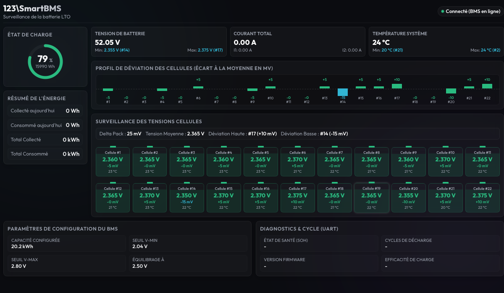
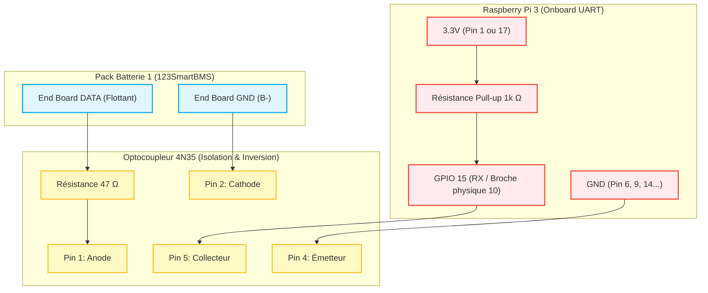

# Solar-Assistant 123SmartBMS Integration

Ce dépôt Git contient l'intégration du BMS **123SmartBMS** (physiquement connecté au port série intégré du Raspberry Pi `/dev/ttyAMA0`) avec le dashboard **Solar-Assistant**.



Il permet :
1. De générer un tableau de bord Web local (port `8080`) affichant les tensions et températures en temps réel.
2. D'émuler un port série virtuel (**Daly BMS**) sur `/dev/ttyS9` pour renvoyer la télémétrie recalculée (y compris un SoC LTO précis pour Yinlong 400Ah) directement à Solar-Assistant.

## Fichiers du dépôt
- `server_smartbms.py` : Serveur Python qui lit le 123SmartBMS et émule le protocole Daly BMS.
- `index.html` : Interface web du tableau de bord.
- `setup_virtual_port.sh` : Script de configuration noyau (socat + mock sysfs) pour injecter le port virtuel dans Solar-Assistant.
- `smartbms-web.service` : Service systemd pour le tableau de bord web.
- `virtual-bms-port.service` : Service systemd pour le port série virtuel.
- `install.sh` : Script d'installation automatisé.
- `memoire.md` : Guide de maintenance et procédure manuelle.

---

## 🚀 Guide d'installation rapide (sur un nouveau Pi)

### Étape 1 : Mettre le dépôt sur votre GitHub personnel

Si vous souhaitez héberger ce code sur votre compte GitHub (par exemple sous le nom `123SmartBMS_for_Solar_Assistant`) :

1. Créez un nouveau dépôt vide sur [GitHub](https://github.com/new).
2. Ouvrez un terminal dans ce dossier sur votre Mac et associez-le à votre dépôt distant :
   ```bash
   git remote add origin git@github.com:speriator/123SmartBMS_for_Solar_Assistant.git
   git branch -M main
   git push -u origin main
   ```

### Étape 2 : Lancer l'installation sur le Raspberry Pi

Connectez-vous en SSH sur le nouveau Raspberry Pi de destination :
```bash
ssh solar-assistant@192.168.80.XXX
```

Puis, téléchargez le dépôt et lancez l'installateur automatique en une seule commande :
```bash
# 1. Cloner votre dépôt Git
git clone https://github.com/speriator/123SmartBMS_for_Solar_Assistant.git

# 2. Entrer dans le dossier et exécuter l'installateur
cd 123SmartBMS_for_Solar_Assistant
sudo ./install.sh
```

### Étape 3 : Redémarrer le Pi
Pour appliquer les configurations de boot nécessaires (overlays de port série), redémarrez le Raspberry Pi :
```bash
sudo reboot
```

### Étape 4 : Activer le port dans Solar-Assistant
1. Allez sur l'interface web de Solar-Assistant.
2. Dans **Configuration**, sous **Battery**, sélectionnez **USB Daly UART/RS485**.
3. Dans la liste déroulante des ports USB, sélectionnez **ttyS9** (ou `serial8250`).
4. Cliquez sur **Connect**.
5. Les tensions individuelles de vos 22 cellules et le SoC précis apparaîtront instantanément !

---

## 🔌 Schéma de Câblage Matériel (123SmartBMS -> Raspberry Pi)

Le signal série de la carte de fin du **123SmartBMS** est **physiquement inversé**. Pour le relier au port UART intégré du Raspberry Pi (`ttyAMA0` / GPIO 15), il est nécessaire de réaliser un montage d'isolation et d'inversion à l'aide d'un optocoupleur (ex: **4N35**).

Voici le schéma de connexion logique :



### Détails des Connexions :
1. **Côté BMS :**
   - Connectez la borne **DATA** du 123SmartBMS à la broche **1** (Anode) de l'optocoupleur via une résistance de **47 Ω**.
   - Connectez la borne **GND (B-)** du 123SmartBMS directement à la broche **2** (Cathode) de l'optocoupleur.
2. **Côté Raspberry Pi :**
   - Reliez la broche **5** (Collecteur) de l'optocoupleur à l'entrée série du Pi (**GPIO 15 / RX / Broche physique 10**) et tirez-la vers le **3.3V** du Pi via une résistance de pull-up de **1 kΩ**.
   - Reliez la broche **4** (Émetteur) de l'optocoupleur au **GND** du Raspberry Pi.

